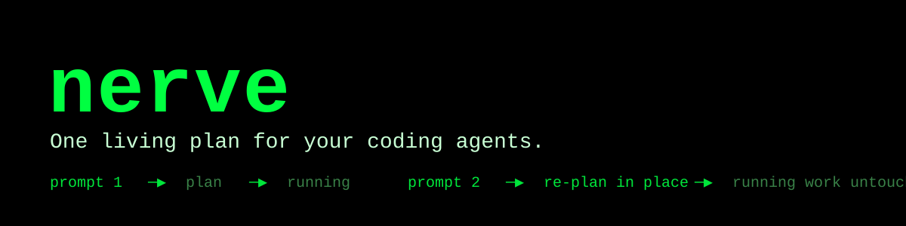

# nerve

**One living plan for your coding agents.**

nerve keeps multi-agent coding work in a single, persistent task graph. Keep
sending prompts: each one **incrementally re-plans** the work that's still ahead,
while work already running keeps running — no restarts, no lost progress.

Most agents run a task list. nerve runs a graph that remembers.

[](https://github.com/includecctype/nerve-ibm-bob-2-0-hackathon/actions/workflows/ci.yml)
· [Live web demo](https://includecctype.github.io/nerve-ibm-bob-2-0-hackathon/)
· [Documentation](doc/README.md)



## The problem: agents forget, and restarts waste work

Today's coding agents treat every prompt as a fresh start:

- **Restarts lose work.** Change your mind mid-run and you're told to restart the
  prompt — throwing away everything already in flight.
- **Every prompt re-plans from scratch.** Overlapping work gets redone and intent
  from earlier prompts is forgotten.
- **Parallel work has no structure.** Whether tasks depend on each other, overlap,
  or could run together lives only in the model's prose, and vanishes the moment
  the request ends.

## What nerve does

- **One living plan.** A persistent task graph that survives across prompts and
  sessions.
- **Incremental re-planning.** A new prompt reshapes the work that's still ahead;
  work already running is never disturbed.
- **Work as a graph, not a list.** First-class relationships: `depends_on`
  ordering, duplicate removal, and each category's results flowing into its
  dependents.
- **Dependency-aware parallelism.** Categories launch the moment their
  dependencies finish, and a failure cascades `blocked` to everything downstream.
- **In-flight protection.** Running work is immutable, so "keep sending prompts"
  can never race an executor mid-change.
- **Your code stays yours.** In the CLI, file and shell tools run on your machine;
  the server only makes model calls and optional web searches.

## See it: one plan, three prompts

```
prompt 1 · "fix the login bug"
        │
        ▼
   ┌──────────────────────┐
   │ login-fix       ▶ running │
   └──────────────────────┘
        │
prompt 2 · "also harden session handling"      (sent while login-fix is running)
        │
        ▼
   ┌──────────────────────┐   ┌──────────────────────┐
   │ login-fix       ▶ running │   │ session-hardening  pending │   ← added to the plan
   └──────────────────────┘   └──────────────────────┘
        │
prompt 3 · "actually, drop the session work"   (sent while login-fix is running)
        │
        ▼
   ┌──────────────────────┐        session-hardening removed from pending work;
   │ login-fix       ▶ running │   login-fix was never interrupted
   └──────────────────────┘
```

Each prompt is planned immediately and folded into the same running plan. When the
plan drains, nerve reports what finished — as its own message.

## Why it's different

| | Typical coding agents | nerve |
|---|---|---|
| **Unit of work** | one prompt / one spawned agent | an entry in a persistent work graph |
| **Across prompts** | re-plans from scratch | **incremental re-planning** on one living plan |
| **Work relationships** | implicit in the model's prose | **first-class**: `depends_on`, dedupe, result flow |
| **Parallelism** | decided ad hoc | dispatched from explicit dependency readiness |
| **Changing course** | start the prompt over | keep going; only pending work changes |
| **Where code runs** (CLI) | a vendor server | on your machine |

## How it works

```
prompt ─▶ main agent (LangChain)
            ├─ processNewTask(categories)     categories = {name, tasks, depends_on}
            └─ executeCurrentTask()           starts or joins the background pass
                     │
        ┌────────────┴────────────┐
        ▼                         ▼
  ready category            ready category          ← run in parallel
  (a fresh sub-agent per task) (a fresh sub-agent per task)
        │                         │
        └───────── results ───────┘
                     ▼
              results turn ─▶ main agent reports back
```

- One prompt worker per session turns prompts into planning turns, so turns never
  overlap.
- Execution runs in a **detached background pass**; a planning gate keeps it from
  exiting while a later prompt is still re-planning.
- Only `pending_categories` is ever replaced — `running_categories` is untouched by
  design.

Full detail: [architecture](doc/engineering/architecture.md) ·
[pipelines](doc/engineering/pipelines.md).

## Try it

**Web workspace (live demo):**
<https://includecctype.github.io/nerve-ibm-bob-2-0-hackathon/> — the same Ink
terminal plus an OCI-backed file explorer and viewer.

**Backend** (Python 3.13 + [uv](https://docs.astral.sh/uv/)):

```bash
cd backend
uv sync --all-extras
uv run main.py                     # → Uvicorn on 0.0.0.0:8000
```

**CLI** (Node 22 + pnpm):

```bash
cd terminal
pnpm install
NERVE_BACKEND_URL=http://localhost:8000 pnpm dev
```

**Web workspace**, or everything at once with the `justfile`:

```bash
cd web && pnpm install && NERVE_BACKEND_URL=http://localhost:8000 pnpm dev
just backend   # gateway on :8000
just terminal  # CLI
just web       # browser workspace
```

Models are selected by id: the CLI offers 1–5, and the web workspace adds the
provided model 6 (DeepSeek Flash, funded by the operator via `PROVIDED_MODEL_KEY`;
the gateway refuses it for any non-web client). In the CLI, `↑`/`↓` and
`PageUp`/`PageDown` scroll the chat, `Ctrl+↑`/`Ctrl+↓` scroll the Tasks pane, and
`Esc` clears the prompt.

Setup details — environment variables, OCI storage, rate limits, and checks —
live in [build_and_run](doc/engineering/build_and_run.md).

## Built with IBM Bob

The agent configuration is committed and verifiable:

| Artifact | Purpose |
|---|---|
| `AGENTS.md` | Working agreement: plan first, ask before assuming, follow the rules. |
| `.opencode/opencode.json` + `.opencode/rules/*` | Agent runtime config: MCP servers (Obsidian, LibreOffice, Penpot), permissions, structure/naming rules. |
| `.bob/mcp.json` + `.bob/rules/*` | Mirrored Bob rules and MCP config. |

How Bob was directed: one **git worktree per concern**, each landed through its own
pull request with green checks before merge; Bob used for planning, bug hunting,
solution exploration, and documentation (it maintains the docs in `doc/` and the
project notes through the MCP tooling) — not as a runtime dependency.

## Business value

nerve is a **coordination layer**, not another executor — the memory, scheduling,
and interaction shell around agents you already run.

- **Cost avoidance.** One living plan stops duplicate and re-planned work from
  burning tokens and wall-clock.
- **Security.** In the CLI, code and secrets never leave the developer's machine;
  the server is a thin Socket.IO + model orchestrator with no database.
- **Responsiveness.** Teams keep re-steering instead of restarting, which shortens
  the gap between intent and working code.

The full case is in [business_value](doc/product/business_value.md).

## Repository map

| Path | What it is |
|---|---|
| `backend/` | Python 3.13 Socket.IO gateway: LangChain/LangGraph agents, DAG scheduler, OCI storage |
| `terminal/` | Node 22 + pnpm CLI (Ink/React) — the two-pane TUI |
| `web/` | Vite + React browser workspace: Ink via ink-web, plus an OCI file explorer and viewer |
| `doc/` | Engineering and product reference documentation |
| `docker-compose.yml`, `justfile` | Backend hosting and dev shortcuts |

## Learn more

- [Problem](doc/product/problem.md) · [Solution](doc/product/solution.md) ·
  [Competition analysis](doc/product/competition_analysis.md)
- [Architecture](doc/engineering/architecture.md) ·
  [Pipelines](doc/engineering/pipelines.md) ·
  [Socket protocol](doc/engineering/socket_protocol.md) ·
  [AI tools](doc/engineering/ai_tools.md)
- [Build & run](doc/engineering/build_and_run.md) ·
  [Full documentation index](doc/README.md)
